# Resume Matcher System - Design Document

**Version:** 1.0
**Date:** November 11, 2025
**Status:** Production Ready
**Classification:** Internal Use

---

## Document Control

| Version | Date | Author | Changes |
|---------|------|--------|---------|
| 1.0 | 2025-11-11 | AI Development Team | Initial design document |

---

## Table of Contents

1. [Executive Summary](#1-executive-summary)
2. [System Overview](#2-system-overview)
3. [Architecture](#3-architecture)
4. [Component Specifications](#4-component-specifications)
5. [Data Models](#5-data-models)
6. [Algorithm Specifications](#6-algorithm-specifications)
7. [API Specifications](#7-api-specifications)
8. [User Interface Design](#8-user-interface-design)
9. [Data Flow](#9-data-flow)
10. [Deployment Architecture](#10-deployment-architecture)
11. [Security & Privacy](#11-security--privacy)
12. [Performance & Scalability](#12-performance--scalability)
13. [Testing Strategy](#13-testing-strategy)
14. [Monitoring & Logging](#14-monitoring--logging)
15. [Error Handling](#15-error-handling)
16. [Future Enhancements](#16-future-enhancements)
17. [Appendices](#17-appendices)

---

## 1. Executive Summary

### 1.1 Purpose

The **Resume Matcher** is an AI-powered intelligent recruitment tool designed to automate and enhance the resume screening process. It analyzes resumes against job descriptions using a sophisticated multi-dimensional scoring system that combines semantic understanding with explicit keyword matching.

### 1.2 Business Value

- **Time Savings:** Reduces manual resume screening time by 80-90%
- **Accuracy:** Provides consistent, objective evaluation across all candidates
- **Transparency:** Offers detailed score breakdowns and justifications
- **Scalability:** Can process hundreds of resumes in minutes
- **Quality:** AI-generated feedback helps candidates improve applications

### 1.3 Key Features

1. **Multi-Dimensional Scoring:** 5-component weighted scoring system
2. **Semantic Understanding:** Deep learning-based embeddings for contextual matching
3. **Keyword Intelligence:** Advanced extraction with variant matching (C#, Node.js, etc.)
4. **AI Feedback:** Automated analysis of strengths, gaps, and recommendations
5. **Resume Enhancement:** AI-powered resume rewriting with keyword optimization
6. **Deterministic Results:** Caching ensures consistent scoring across runs
7. **Batch Processing:** Handle multiple resumes simultaneously

### 1.4 Technology Stack

- **Frontend:** Streamlit (Python web framework)
- **Backend:** Python 3.x
- **AI/ML:** OpenAI GPT-4o-mini, Ollama (local embeddings)
- **Vector DB:** ChromaDB
- **Embedding Model:** nomic-embed-text (768 dimensions)
- **Document Processing:** python-docx

---

## 2. System Overview

### 2.1 System Context

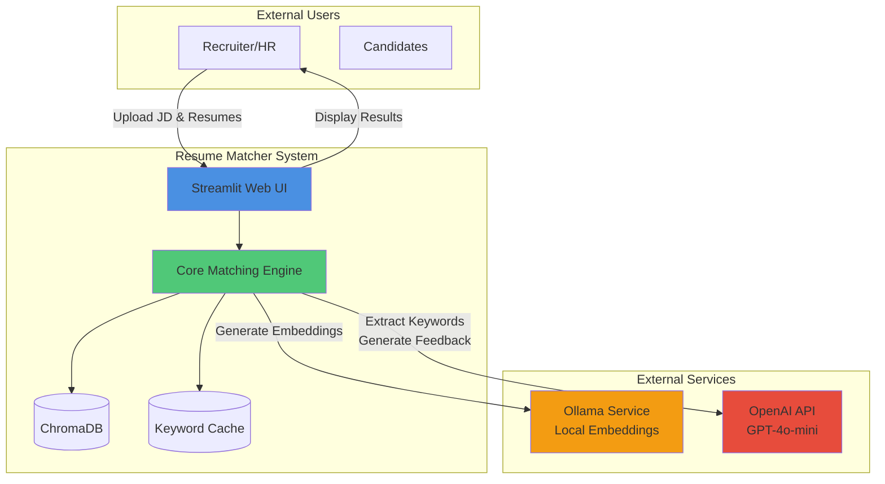

### 2.2 High-Level Architecture

The system follows a **modular architecture** with clear separation of concerns:

1. **Presentation Layer:** Streamlit UI
2. **Business Logic Layer:** Scoring algorithms, matching engine
3. **AI/ML Layer:** Embedding generation, LLM integration
4. **Data Layer:** ChromaDB, file system cache
5. **External Integration Layer:** API clients for Ollama and OpenAI

### 2.3 Core Capabilities

| Capability | Description | Technology |
|------------|-------------|------------|
| Document Processing | Extract text from .docx files | python-docx |
| Semantic Analysis | Generate and compare embeddings | Ollama + nomic-embed-text |
| Keyword Extraction | Extract technical skills from JD | OpenAI GPT-4o-mini |
| Scoring | Multi-component weighted scoring | Custom algorithms |
| Feedback Generation | Provide detailed analysis | OpenAI GPT-4o-mini |
| Resume Rewriting | Enhance resumes with keywords | OpenAI GPT-4o-mini |
| Caching | Ensure deterministic results | File system (pickle) |

---

## 3. Architecture

### 3.1 Logical Architecture

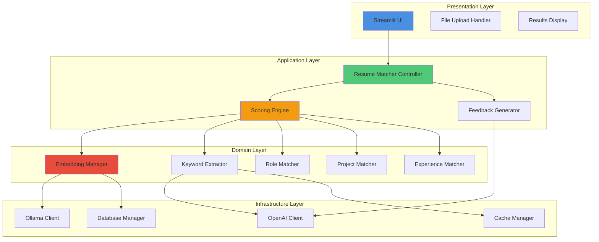

### 3.2 Component Interaction Diagram

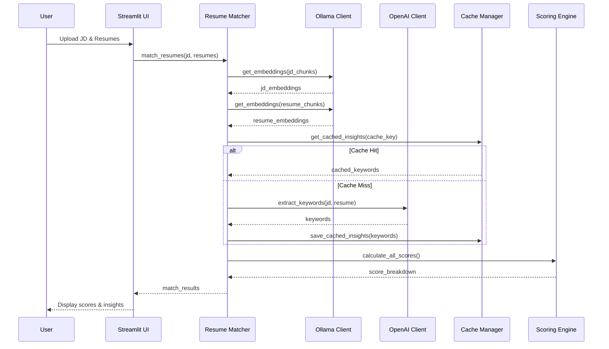

### 3.3 Deployment Architecture

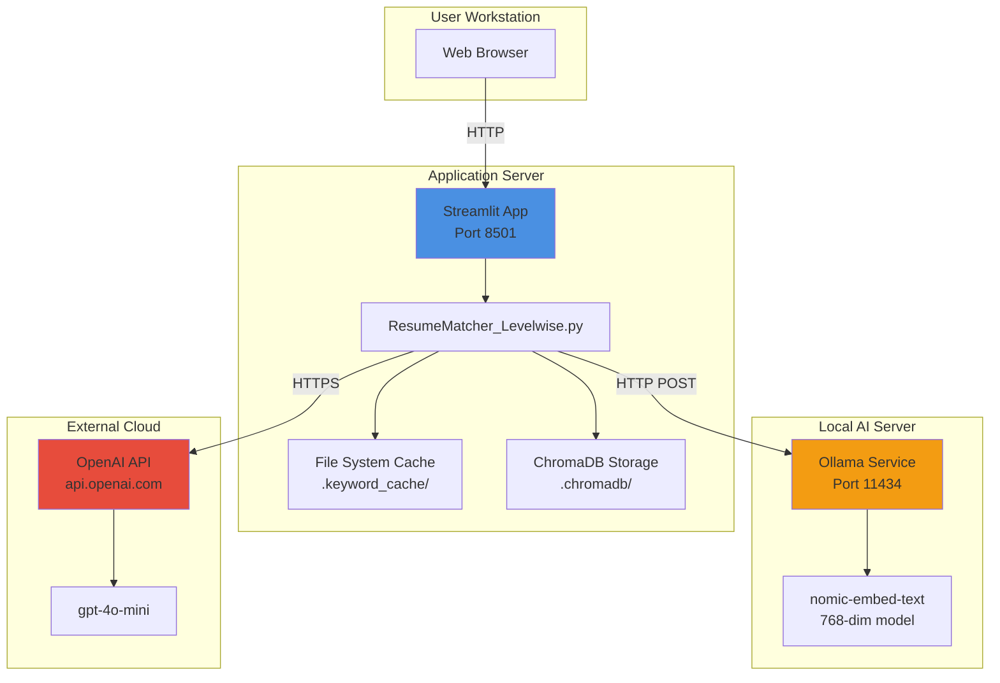

---

## 4. Component Specifications

### 4.1 Ollama Client

**File:** `ResumeMatcher_Levelwise.py` (Lines 73-124)

**Responsibilities:**
- Manage connection to local Ollama embedding service
- Generate semantic embeddings using nomic-embed-text model
- Handle batch and individual embedding requests
- Provide fallback mechanisms for failed batch requests

**Key Methods:**

```python
class OllamaClient:
    def check_connection(self) -> bool
        # Verify Ollama service is accessible

    def get_embeddings(self, texts: list[str]) -> np.ndarray
        # Generate 768-dimensional embeddings
        # Batch processing with fallback to individual
```

**Configuration:**
- **Base URL:** `http://localhost:11434`
- **Model:** `nomic-embed-text`
- **Output:** 768-dimensional float32 vectors
- **Timeout:** 60 seconds

**Error Handling:**
- Batch failure → Fallback to individual embeddings
- Connection timeout → Return zero vectors
- Invalid response → Return zero vectors

---

### 4.2 Document Processing Module

**Functions:** `extract_text_from_docx()`, `chunk_text()`

**Responsibilities:**
- Extract text from Microsoft Word (.docx) files
- Split documents into manageable chunks with overlap
- Preserve semantic context across chunks

**Specifications:**

```python
def extract_text_from_docx(file_obj) -> str:
    """
    Extracts all text from a .docx file
    Returns: Plain text with paragraph separation
    """

def chunk_text(text: str, chunk_size=2000, overlap=200) -> list[str]:
    """
    Splits text into overlapping chunks

    Parameters:
        text: Input text
        chunk_size: Maximum characters per chunk (default: 2000)
        overlap: Characters to overlap between chunks (default: 200)

    Returns: List of text chunks
    """
```

**Chunking Strategy:**
- **Chunk Size:** 2000 characters (optimal for embedding models)
- **Overlap:** 200 characters (10% overlap to preserve context)
- **Splitting:** Character-based (not sentence-aware)

---

### 4.3 Embedding Manager

**Functions:** `cosine_sim()`, `hybrid_similarity()`

**Responsibilities:**
- Calculate cosine similarity between embeddings
- Combine semantic and keyword similarity
- Apply squaring transformation for discrimination

**Mathematical Formulas:**

```python
def cosine_sim(emb1: np.ndarray, emb2: np.ndarray) -> float:
    """
    Cosine Similarity = (A · B) / (||A|| × ||B||)

    For normalized vectors: cos_sim = A · B
    """
    return float(np.dot(emb1, emb2))

def hybrid_similarity(cos_sim: float, keyword_sim: float) -> float:
    """
    Hybrid Score = 0.7 × cosine_sim + 0.3 × keyword_sim
    """
    return 0.7 * cos_sim + 0.3 * keyword_sim
```

**Squaring Transformation:**

```python
# Applied to base semantic and project scores
raw_similarity = np.dot(emb1, emb2)
adjusted_similarity = raw_similarity * abs(raw_similarity)
```

**Purpose:** Amplifies differences between strong and weak matches (prevents over-matching of opposite domains)

---

### 4.4 Keyword Extraction Engine

**File:** `ResumeMatcher_Levelwise.py` (Lines 231-457)

**Responsibilities:**
- Extract technical skills from job descriptions
- Classify skills as matched/unmatched
- Handle technology name variants (C#, Node.js, etc.)
- Ensure deterministic results via caching

**Architecture:**

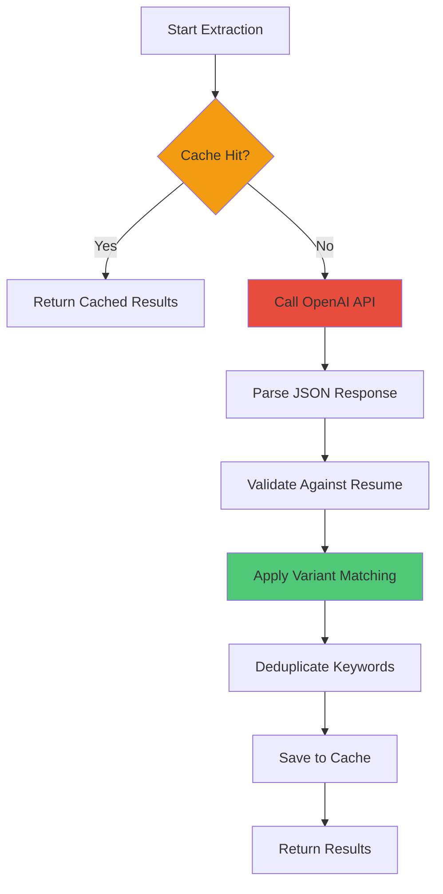

**Variant Matching Rules:**

| Canonical Form | Variants |
|----------------|----------|
| JavaScript | JS, java script |
| Node.js | NodeJS, nodejs |
| C# | C Sharp, CSharp |
| REST API | RESTful, REST, REST APIs |
| PostgreSQL | Postgres, PostgresQL |
| MongoDB | Mongo, Mongo DB |

**Cache Strategy:**
- **Key:** SHA-256 hash of JD + Resume text
- **Storage:** Pickle files in `.keyword_cache/`
- **TTL:** No expiration (manual cleanup)
- **Purpose:** Eliminate LLM non-determinism

**LLM Configuration:**
```python
model: "gpt-4o-mini"
temperature: 0.0  # Deterministic
seed: 42          # Reproducibility
max_tokens: 1500
```

**Output Schema:**

```json
{
  "matched_keywords": ["Python", "Django", "PostgreSQL"],
  "unmatched_keywords": ["AWS", "Kubernetes"],
  "mandatory_skills": ["Python", "Django"],
  "provisional_skills": ["Docker", "CI/CD"]
}
```

---

### 4.5 Scoring Engine

**File:** `ResumeMatcher_Levelwise.py` (Lines 606-762)

**Responsibilities:**
- Calculate 5 component scores
- Apply weighted formula for final score
- Ensure mathematical correctness

**Component Specifications:**

#### 4.5.1 Base Semantic Score (20% weight)

```python
def calculate_base_semantic_score(jd_emb, resume_chunks_emb) -> float:
    """
    1. Calculate mean embedding of all resume chunks
    2. Normalize both JD and resume embeddings
    3. Compute cosine similarity
    4. Apply squaring transformation
    5. Scale to 0-100
    """
    mean_resume = np.mean(resume_chunks_emb, axis=0)
    jd_norm = jd_emb / (np.linalg.norm(jd_emb) + 1e-9)
    resume_norm = mean_resume / (np.linalg.norm(mean_resume) + 1e-9)

    cos_sim_raw = float(np.dot(jd_norm, resume_norm))
    cos_sim_adjusted = cos_sim_raw * abs(cos_sim_raw)  # Squaring

    return round(cos_sim_adjusted * 100, 2)
```

**Expected Ranges:**
- Perfect match: 70-90%
- Good match: 50-70%
- Partial match: 30-50%
- No match: 5-25%

---

#### 4.5.2 Skill Match Score (35% weight - HIGHEST)

```python
def calculate_skill_score(matched_keywords, unmatched_keywords) -> float:
    """
    Formula: (matched_count / total_keywords) × 100
    """
    total = len(matched_keywords) + len(unmatched_keywords)
    if total == 0:
        return 0.0
    return round((len(matched_keywords) / total) * 100, 2)
```

**Expected Ranges:**
- Perfect match: 90-100%
- Good match: 70-90%
- Partial match: 40-60%
- No match: 0-20%

---

#### 4.5.3 Role Match Score (10% weight)

```python
def role_similarity(jd_text: str, resume_text: str, openai_client) -> float:
    """
    1. Extract job title from JD (using LLM)
    2. Extract role keywords (split by space, remove stopwords)
    3. Count keywords present in resume (case-insensitive)
    4. Formula: (matched_keywords / total_keywords) × 100
    """
    # Example: "Senior Python Developer"
    # Keywords: ["Senior", "Python", "Developer"]
    # If resume has "Python" and "Developer" = 2/3 = 66.67%
```

**Expected Ranges:**
- Exact title match: 100%
- Partial match: 33-67%
- No match: 0%

---

#### 4.5.4 Project Match Score (20% weight)

```python
def project_similarity(jd_emb, chunks, chunk_embs) -> float:
    """
    1. Identify chunks containing "project" (case-insensitive)
    2. Calculate cosine similarity of each project chunk to JD
    3. Apply squaring transformation
    4. Return average similarity × 100
    5. Return 0% if no project chunks found
    """
    project_chunks = [i for i, c in enumerate(chunks)
                      if "project" in c.lower()]
    if not project_chunks:
        return 0.0

    sims = []
    for i in project_chunks:
        sim = cosine_sim(jd_emb, chunk_embs[i])
        sim = sim * abs(sim)  # Squaring
        sims.append(sim)

    return round(np.mean(sims) * 100, 2)
```

**Expected Ranges:**
- Highly relevant projects: 70-90%
- Somewhat relevant: 40-60%
- Unrelated projects: 10-30%
- No projects: 0%

---

#### 4.5.5 Experience Score (15% weight)

```python
def experience_similarity(jd_text: str, resume_text: str) -> float:
    """
    1. Extract required years from JD (regex: \d+\+?\s*years?)
    2. Extract candidate years from resume (all year mentions, take max)
    3. Formula: min(candidate_years / required_years, 1.0) × 100
    4. Caps at 100% (no penalty for exceeding requirements)
    """
    required = extract_years_from_jd(jd_text)  # e.g., 5
    candidate = extract_years_from_resume(resume_text)  # e.g., 7

    if required == 0:
        return 100.0

    ratio = min(candidate / required, 1.0)
    return round(ratio * 100, 2)
```

**Examples:**
- Required: 5, Has: 7 → 100%
- Required: 5, Has: 3 → 60%
- Required: 5, Has: 2 → 40%

---

#### 4.5.6 Final Score Calculation

```python
def calculate_final_score(base, skill, role, project, experience) -> float:
    """
    Weighted average of all components

    Weights:
    - Skill Match: 35% (highest priority)
    - Base Semantic: 20%
    - Project Match: 20%
    - Experience: 15%
    - Role Match: 10%

    Total: 100%
    """
    final = (base * 0.20 +
             skill * 0.35 +
             role * 0.10 +
             project * 0.20 +
             experience * 0.15)

    return round(final, 2)
```

**Validation:**
- Sum of weights = 1.0 ✓
- Output range: 0-100% ✓
- Skills have highest impact ✓

---

### 4.6 Feedback Generator

**File:** `ResumeMatcher_Levelwise.py` (Lines 459-543)

**Responsibilities:**
- Generate structured analysis of resume vs JD
- Provide strengths, gaps, and recommendations
- Ensure truthful, non-fabricated feedback

**LLM Configuration:**
```python
model: "gpt-4o-mini"
temperature: 0.3  # Slightly creative but controlled
max_tokens: 2000
```

**Prompt Structure:**

```
PART 1: Requirements Analysis
- List all JD requirements
- Indicate which are met in resume

PART 2: Strengths
- Highlight matching skills
- Mention relevant experience

PART 3: Gaps & Recommendations
- Identify missing keywords
- Suggest improvements
```

**Output Format:**

```
## Part 1: Job Requirements vs Resume Coverage
✅ Python: Present (7 years experience)
✅ Django: Present (mentioned in projects)
❌ Kubernetes: Not found
❌ AWS: Not mentioned

## Part 2: Strengths
- Strong Python background with 7 years
- Relevant project experience...

## Part 3: Gaps & Recommendations
- Add Kubernetes experience/training
- Mention AWS certifications if any...
```

---

### 4.7 Resume Rewriter

**File:** `ResumeMatcher_Levelwise.py` (Lines 545-611)

**Responsibilities:**
- Enhance resume with missing keywords
- Maintain truthfulness (no fabrication)
- Preserve original structure and content

**Critical Rules:**

1. **NO FABRICATION:** Only enhance existing content
2. **KEYWORD INTEGRATION:** Incorporate unmatched keywords where relevant
3. **PRESERVE TRUTH:** Don't add fake experiences or skills
4. **ENHANCE, DON'T REPLACE:** Keep original resume intact

**LLM Configuration:**
```python
model: "gpt-4o-mini"
temperature: 0.3
max_tokens: 3000
```

**Rewriting Strategy:**

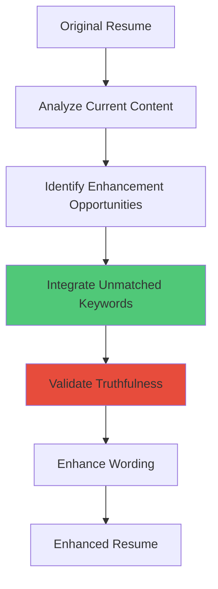

---

## 5. Data Models

### 5.1 Resume Result Object

```python
@dataclass
class ResumeResult:
    """
    Complete result object for a single resume
    """
    resume_name: str                    # Filename
    match_perc: float                   # Final weighted score (0-100)

    # Component scores
    base_score: float                   # Semantic similarity (0-100)
    skill_score: float                  # Keyword match (0-100)
    role_score: float                   # Role match (0-100)
    project_score: float                # Project relevance (0-100)
    experience_score: float             # Experience ratio (0-100)

    # Full text
    text: str                           # Complete resume text

    # Chunk classification
    matched_chunks: List[str]           # Chunks above threshold (0.5)
    unmatched_chunks: List[str]         # Chunks below threshold

    # Keyword insights
    insights: KeywordInsights
    from_cache: bool                    # Cache hit indicator

    # Diagnostics
    raw_cosine_sim: float               # Before squaring
    adjusted_cosine_sim: float          # After squaring
```

---

### 5.2 Keyword Insights Object

```python
@dataclass
class KeywordInsights:
    """
    Keyword extraction results
    """
    matched_keywords: List[str]         # Skills found in resume
    unmatched_keywords: List[str]       # Skills missing from resume
    mandatory_skills: List[str]         # Required/must-have skills
    provisional_skills: List[str]       # Nice-to-have skills
```

**Invariants:**
- `matched_keywords ∩ unmatched_keywords = ∅` (no overlap)
- `matched_keywords ∪ unmatched_keywords = all_keywords`
- All keywords validated against resume text

---

### 5.3 Database Schema (ChromaDB)

```python
Collection: "resume_chunks"
Metadata: {"hnsw:space": "cosine"}

Document Schema:
{
    "id": str,                    # Unique chunk identifier
    "embedding": np.ndarray,      # 768-dim float32 vector
    "metadata": {
        "source": str,            # "resume" or "jd"
        "document_name": str,     # Filename
        "chunk_index": int,       # Position in document
        "timestamp": str          # ISO 8601 datetime
    },
    "document": str               # Original chunk text
}
```

---

### 5.4 Cache File Structure

```python
Cache Directory: .keyword_cache/

File Format: <cache_key>.pkl

cache_key = SHA-256(jd_text + "|||" + resume_text)

Cached Object:
{
    "matched_keywords": List[str],
    "unmatched_keywords": List[str],
    "mandatory_skills": List[str],
    "provisional_skills": List[str],
    "timestamp": str,
    "version": str                # For schema migration
}
```

---

## 6. Algorithm Specifications

### 6.1 Main Matching Algorithm

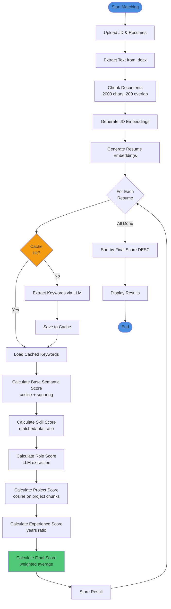

---

### 6.2 Squaring Transformation Algorithm

**Problem:** Raw cosine similarity over-matches opposite domains (60% similarity between Data Scientist and Mechanical Engineer)

**Solution:** Apply squaring transformation to amplify differences

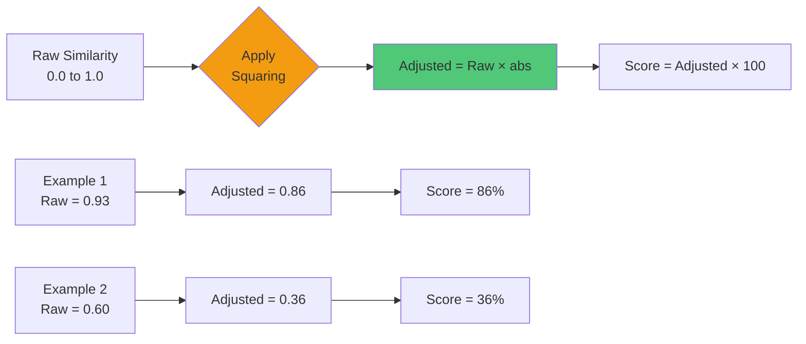

**Mathematical Effect:**

| Raw | Adjusted | Change |
|-----|----------|--------|
| 0.93 | 0.86 | -7% |
| 0.78 | 0.61 | -17% |
| 0.60 | 0.36 | -24% |
| 0.50 | 0.25 | -25% |
| 0.30 | 0.09 | -21% |

**Key Insight:** Squaring **amplifies differences** while preserving strong matches.

---

### 6.3 Variant Matching Algorithm

**Purpose:** Match technology names despite different representations

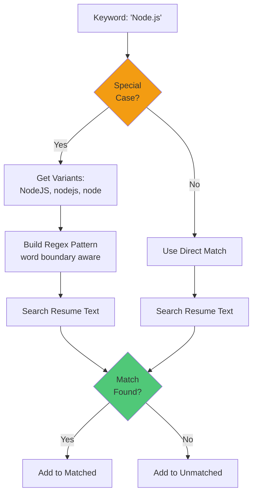

**Special Cases:**

```python
VARIANT_PATTERNS = {
    "Node.js": ["nodejs", "node js", "node"],
    "C#": ["c sharp", "csharp"],
    "JavaScript": ["js", "java script"],
    "REST API": ["restful", "rest", "rest apis"],
    "PostgreSQL": ["postgres", "postgresq"],
    "MongoDB": ["mongo", "mongo db"]
}
```

**Regex Pattern:**
```python
pattern = r'\b(' + '|'.join(variants) + r')\b'
flags = re.IGNORECASE
```

---

### 6.4 Deduplication Algorithm

**Purpose:** Ensure no keyword appears in both matched and unmatched lists

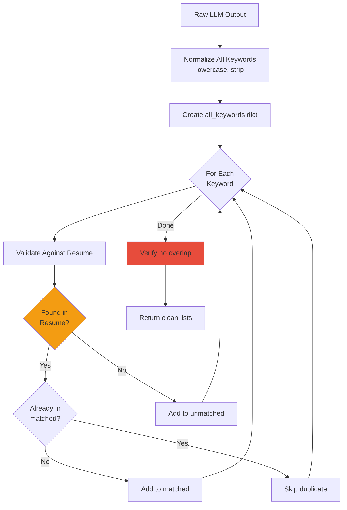

**Pseudocode:**

```python
def deduplicate_keywords(matched_raw, unmatched_raw, resume_text):
    all_keywords = {}  # normalized -> canonical
    matched_final = []
    unmatched_final = []

    # Process all keywords
    for kw in (matched_raw + unmatched_raw):
        normalized = normalize_keyword(kw)

        if normalized in all_keywords:
            continue  # Already seen

        all_keywords[normalized] = kw

        # Validate against resume
        if exists_in_resume(kw, resume_text):
            matched_final.append(kw)
        else:
            unmatched_final.append(kw)

    # Verify invariant
    assert set(matched_final) & set(unmatched_final) == set()

    return matched_final, unmatched_final
```

---

## 7. API Specifications

### 7.1 Ollama Embedding API

**Endpoint:** `POST http://localhost:11434/api/embeddings`

**Request:**
```json
{
  "model": "nomic-embed-text",
  "prompt": [
    "Text chunk 1",
    "Text chunk 2"
  ]
}
```

**Response:**
```json
{
  "embeddings": [
    [0.123, -0.456, ..., 0.789],  // 768 dimensions
    [0.234, -0.567, ..., 0.890]
  ]
}
```

**Error Handling:**
- Timeout (60s) → Retry with individual chunks
- Connection refused → Return zero embeddings
- Invalid model → Raise configuration error

---

### 7.2 OpenAI Keyword Extraction API

**Endpoint:** `POST https://api.openai.com/v1/chat/completions`

**Request:**
```json
{
  "model": "gpt-4o-mini",
  "temperature": 0.0,
  "seed": 42,
  "max_tokens": 1500,
  "messages": [
    {
      "role": "system",
      "content": "You are a technical skill extractor..."
    },
    {
      "role": "user",
      "content": "JD: ...\n\nResume: ..."
    }
  ],
  "response_format": { "type": "json_object" }
}
```

**Response:**
```json
{
  "choices": [
    {
      "message": {
        "content": "{\"matched_keywords\": [...], \"unmatched_keywords\": [...]}"
      }
    }
  ]
}
```

**Prompt Engineering:**

```
CRITICAL RULES:
1. Extract ONLY technical skills (tools, technologies, frameworks, languages)
2. EXCLUDE: soft skills, generic verbs, dates, numbers
3. INCLUDE: Specific technologies (e.g., "Python", "Django", "AWS")
4. Return VALID JSON with these keys:
   - matched_keywords: skills found in resume
   - unmatched_keywords: skills NOT in resume
   - mandatory_skills: required/must-have
   - provisional_skills: nice-to-have

5. Each keyword should be:
   - Human-readable (e.g., "Node.js" not "nodejs")
   - Canonical form (e.g., "JavaScript" not "JS")
   - Max 4 words
```

---

### 7.3 OpenAI Feedback Generation API

**Endpoint:** `POST https://api.openai.com/v1/chat/completions`

**Request:**
```json
{
  "model": "gpt-4o-mini",
  "temperature": 0.3,
  "max_tokens": 2000,
  "messages": [
    {
      "role": "system",
      "content": "You are a professional resume analyzer..."
    },
    {
      "role": "user",
      "content": "JD: ...\nResume: ...\nScores: ...\nKeywords: ..."
    }
  ]
}
```

**Expected Output Structure:**

```markdown
## Part 1: Job Requirements vs Resume Coverage
[Checklist format with ✅/❌]

## Part 2: Strengths
[Bullet points of matching qualifications]

## Part 3: Gaps & Recommendations
[Constructive suggestions for improvement]
```

---

## 8. User Interface Design

### 8.1 Main Page Layout

```
┌─────────────────────────────────────────────────────┐
│  Resume Matcher - AI-Powered Recruitment Tool      │
│                                                     │
│  [OpenAI API Key: _______________] (optional)      │
└─────────────────────────────────────────────────────┘

┌─────────────────────────────────────────────────────┐
│  📄 Upload Job Description                          │
│  [Drag & Drop .docx or paste text]                 │
└─────────────────────────────────────────────────────┘

┌─────────────────────────────────────────────────────┐
│  📎 Upload Resumes (Multiple)                       │
│  [Drag & Drop .docx files]                         │
└─────────────────────────────────────────────────────┘

┌─────────────────────────────────────────────────────┐
│  [Match Resumes] ← Button                           │
└─────────────────────────────────────────────────────┘

┌─────────────────────────────────────────────────────┐
│  Results (Sorted by Match Score)                    │
│                                                     │
│  ┌───────────────────────────────────────────────┐ │
│  │ Resume 1: John_Doe.docx - 89.5% Match        │ │
│  │ Resume 2: Jane_Smith.docx - 67.2% Match      │ │
│  │ Resume 3: Alex_Chen.docx - 45.8% Match       │ │
│  └───────────────────────────────────────────────┘ │
└─────────────────────────────────────────────────────┘
```

---

### 8.2 Detailed Resume View (Tabs)

```
┌─────────────────────────────────────────────────────┐
│  John_Doe.docx - Final Score: 89.5%                 │
│                                                     │
│  [Score Breakdown] [Keywords] [Diagnostics] [Feedback]│
└─────────────────────────────────────────────────────┘

┌─────────────────────────────────────────────────────┐
│  📊 Score Breakdown                                  │
│                                                     │
│  Base Semantic:    75.3%  ▰▰▰▰▰▰▰▱▱▱ (20% weight)  │
│  Skill Match:      92.0%  ▰▰▰▰▰▰▰▰▰▱ (35% weight)  │
│  Role Match:       100.0% ▰▰▰▰▰▰▰▰▰▰ (10% weight)  │
│  Project Match:    85.7%  ▰▰▰▰▰▰▰▰▱▱ (20% weight)  │
│  Experience:       100.0% ▰▰▰▰▰▰▰▰▰▰ (15% weight)  │
│                                                     │
│  Final Score:      89.5%  ▰▰▰▰▰▰▰▰▰▱               │
└─────────────────────────────────────────────────────┘

┌─────────────────────────────────────────────────────┐
│  🔑 Keyword Insights                    [From Cache]│
│                                                     │
│  ✅ Matched Skills (23):                            │
│     Python, Django, PostgreSQL, Docker, AWS, ...   │
│                                                     │
│  ❌ Missing Skills (2):                             │
│     Kubernetes, Terraform                          │
│                                                     │
│  🔴 Mandatory Skills:                               │
│     Python, Django, PostgreSQL, REST API           │
│                                                     │
│  🟡 Preferred Skills:                               │
│     Docker, CI/CD, Microservices                   │
└─────────────────────────────────────────────────────┘

┌─────────────────────────────────────────────────────┐
│  🔍 Embedding Diagnostics                           │
│                                                     │
│  Raw cosine similarity: 0.7531                     │
│  Adjusted similarity: 0.5672 (after squaring)      │
│  Final base score: 56.72%                          │
│                                                     │
│  Matched chunks: 15                                │
│  Unmatched chunks: 3                               │
└─────────────────────────────────────────────────────┘

┌─────────────────────────────────────────────────────┐
│  💬 AI Feedback                                      │
│                                                     │
│  [Generate Initial Feedback] ← Button              │
│  [Rewrite Resume with Keywords] ← Button           │
│                                                     │
│  [Feedback content appears here...]                │
└─────────────────────────────────────────────────────┘
```

---

### 8.3 UI Components Specification

| Component | Type | Validation | Default |
|-----------|------|------------|---------|
| API Key Input | Password field | Non-empty | From env var |
| JD Upload | File uploader (.docx) | Required | None |
| JD Text Input | Text area | Min 50 chars | None |
| Resume Upload | Multi-file uploader (.docx) | Min 1 file | None |
| Match Button | Primary button | Disabled until JD+Resume | N/A |
| Results Table | DataFrame | Auto-sort by score | DESC |
| Score Bars | Progress bar | 0-100% | Dynamic |
| Tabs | Tab container | Persist selection | First tab |
| Cache Badge | Info label | Show if from_cache | Hidden |

---

## 9. Data Flow

### 9.1 End-to-End Data Flow

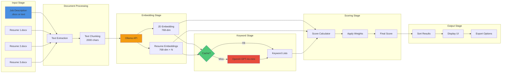

---

### 9.2 Embedding Pipeline Detail

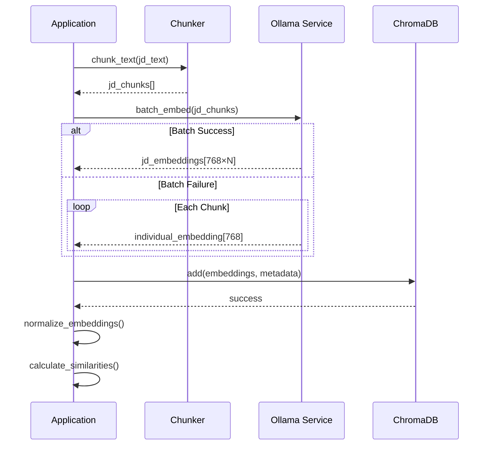

---

### 9.3 Cache Data Flow

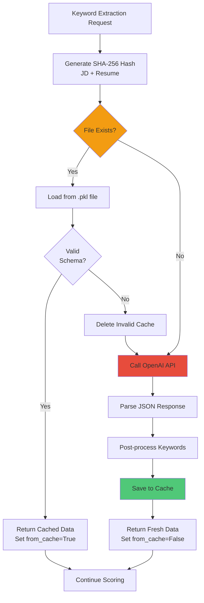

---

## 10. Deployment Architecture

### 10.1 System Requirements

#### Hardware Requirements

| Component | Minimum | Recommended |
|-----------|---------|-------------|
| CPU | 4 cores | 8+ cores |
| RAM | 8 GB | 16 GB |
| Storage | 10 GB | 50 GB SSD |
| GPU | None | NVIDIA (optional) |

#### Software Requirements

| Software | Version | Purpose |
|----------|---------|---------|
| Python | 3.10+ | Runtime |
| Ollama | Latest | Embedding service |
| Git | 2.0+ | Version control |
| pip | Latest | Package manager |

---

### 10.2 Installation Steps

```bash
# 1. Clone repository
git clone <repository_url>
cd ResumeMatcher/Dev

# 2. Create virtual environment
python -m venv venv
source venv/bin/activate  # Windows: venv\Scripts\activate

# 3. Install dependencies
pip install -r requirements.txt

# 4. Install and start Ollama
# Download from: https://ollama.ai
ollama serve

# 5. Pull embedding model
ollama pull nomic-embed-text

# 6. Set environment variables
export OPENAI_API_KEY="sk-..."

# 7. Run application
streamlit run ResumeMatcher_Levelwise.py
```

---

### 10.3 Deployment Topologies

#### Option 1: Local Development

```
┌─────────────────────────────┐
│   Developer Laptop          │
│                             │
│   ┌─────────────────────┐   │
│   │ Streamlit App       │   │
│   │ Port: 8501          │   │
│   └─────────────────────┘   │
│                             │
│   ┌─────────────────────┐   │
│   │ Ollama Service      │   │
│   │ Port: 11434         │   │
│   └─────────────────────┘   │
│                             │
│   ┌─────────────────────┐   │
│   │ ChromaDB            │   │
│   │ .chromadb/          │   │
│   └─────────────────────┘   │
└─────────────────────────────┘
         │
         │ HTTPS
         ▼
┌─────────────────────────────┐
│   OpenAI API (Cloud)        │
└─────────────────────────────┘
```

---

#### Option 2: Server Deployment

```
┌─────────────────────────────────────────┐
│   Application Server (Ubuntu/CentOS)   │
│                                         │
│   ┌─────────────────────────────────┐   │
│   │ Nginx Reverse Proxy             │   │
│   │ Port: 80/443 (HTTPS)            │   │
│   └─────────────────────────────────┘   │
│            │                            │
│            ▼                            │
│   ┌─────────────────────────────────┐   │
│   │ Streamlit App (systemd)         │   │
│   │ Port: 8501                      │   │
│   └─────────────────────────────────┘   │
│                                         │
│   ┌─────────────────────────────────┐   │
│   │ Ollama Service (systemd)        │   │
│   │ Port: 11434                     │   │
│   └─────────────────────────────────┘   │
│                                         │
│   ┌─────────────────────────────────┐   │
│   │ Persistent Storage              │   │
│   │ /var/lib/resume_matcher/        │   │
│   │   ├── .chromadb/                │   │
│   │   └── .keyword_cache/           │   │
│   └─────────────────────────────────┘   │
└─────────────────────────────────────────┘
```

---

#### Option 3: Docker Deployment

```yaml
# docker-compose.yml

version: '3.8'

services:
  streamlit:
    build: .
    ports:
      - "8501:8501"
    environment:
      - OPENAI_API_KEY=${OPENAI_API_KEY}
      - OLLAMA_BASE_URL=http://ollama:11434
    volumes:
      - ./data:/app/data
    depends_on:
      - ollama

  ollama:
    image: ollama/ollama:latest
    ports:
      - "11434:11434"
    volumes:
      - ollama_data:/root/.ollama

volumes:
  ollama_data:
```

---

### 10.4 Environment Configuration

```bash
# .env file

# OpenAI API
OPENAI_API_KEY=sk-proj-...

# Ollama Configuration
OLLAMA_BASE_URL=http://localhost:11434
EMBED_MODEL=nomic-embed-text

# Application Settings
CHUNK_SIZE=2000
CHUNK_OVERLAP=200
CHUNK_MATCH_THRESHOLD=0.5

# Scoring Weights
WEIGHT_BASE=0.20
WEIGHT_SKILL=0.35
WEIGHT_ROLE=0.10
WEIGHT_PROJECT=0.20
WEIGHT_EXPERIENCE=0.15

# Cache Settings
CACHE_DIR=./.keyword_cache
CACHE_ENABLED=true

# ChromaDB
CHROMA_PERSIST_DIR=./.chromadb

# Logging
LOG_LEVEL=INFO
LOG_FILE=./logs/app.log
```

---

## 11. Security & Privacy

### 11.1 Security Considerations

#### Data Privacy

| Data Type | Storage | Retention | Encryption |
|-----------|---------|-----------|------------|
| Resumes | Temporary memory | Session only | None (local) |
| Job Descriptions | Temporary memory | Session only | None (local) |
| Embeddings | ChromaDB | Persistent | At rest |
| Cache Files | File system | Persistent | None (hashed keys) |
| API Keys | Environment vars | Persistent | OS-level |

**Key Points:**
- ✅ No data sent to cloud except embeddings/keywords
- ✅ No permanent storage of PII
- ✅ Cache uses hashed keys (SHA-256)
- ⚠️ ChromaDB stores embeddings in plaintext
- ⚠️ OpenAI API receives full text (review their privacy policy)

---

### 11.2 API Key Security

**Best Practices:**

```python
# ❌ BAD: Hardcoded in code
api_key = "sk-proj-abc123..."

# ✅ GOOD: Environment variable
api_key = os.getenv("OPENAI_API_KEY")

# ✅ GOOD: User input (for demo/testing)
api_key = st.sidebar.text_input("API Key:", type="password")

# ✅ GOOD: Secret management (production)
# Use: AWS Secrets Manager, Azure Key Vault, HashiCorp Vault
```

**Validation:**
```python
if not api_key or not api_key.startswith("sk-"):
    st.error("Invalid OpenAI API key")
    st.stop()
```

---

### 11.3 Input Validation

**File Upload Security:**

```python
# Allowed file types
ALLOWED_EXTENSIONS = ['.docx']

# File size limit
MAX_FILE_SIZE_MB = 10

def validate_upload(file):
    # Check extension
    if not file.name.endswith('.docx'):
        raise ValueError("Only .docx files allowed")

    # Check file size
    file.seek(0, os.SEEK_END)
    size_mb = file.tell() / (1024 * 1024)
    if size_mb > MAX_FILE_SIZE_MB:
        raise ValueError(f"File too large: {size_mb:.1f}MB")

    file.seek(0)  # Reset pointer
```

**Text Input Sanitization:**

```python
def sanitize_text(text: str) -> str:
    # Remove null bytes
    text = text.replace('\x00', '')

    # Limit length
    MAX_LENGTH = 100_000  # ~50 pages
    if len(text) > MAX_LENGTH:
        text = text[:MAX_LENGTH]

    # Remove control characters (except newlines/tabs)
    text = re.sub(r'[\x00-\x08\x0B-\x0C\x0E-\x1F]', '', text)

    return text.strip()
```

---

### 11.4 Vulnerability Mitigation

| Vulnerability | Risk | Mitigation |
|---------------|------|------------|
| **Prompt Injection** | Medium | Input sanitization, prompt templates |
| **File Upload Abuse** | Medium | File type/size validation |
| **API Key Exposure** | High | Environment vars, no logging |
| **SSRF (Server-Side Request Forgery)** | Low | Ollama URL hardcoded |
| **XSS (Cross-Site Scripting)** | Low | Streamlit handles escaping |
| **Denial of Service** | Medium | File size limits, timeouts |

---

## 12. Performance & Scalability

### 12.1 Performance Metrics

#### Baseline Performance (Single Resume)

| Operation | Avg Time | Max Time | Bottleneck |
|-----------|----------|----------|------------|
| Document extraction | 0.1s | 0.5s | I/O |
| Chunking | 0.05s | 0.2s | CPU |
| Embedding generation | 3-5s | 10s | Ollama API |
| Keyword extraction | 4-6s | 12s | OpenAI API |
| Role extraction | 1-2s | 5s | OpenAI API |
| Scoring calculation | 0.1s | 0.3s | CPU |
| **Total** | **8-15s** | **30s** | **LLM APIs** |

---

#### Batch Performance (10 Resumes)

| Metric | Value | Notes |
|--------|-------|-------|
| Total time | 60-120s | Depends on cache hits |
| Time per resume | 6-12s | Amortized |
| Cache hit benefit | -4s per resume | Keyword extraction skipped |
| Concurrent LLM calls | Sequential | Rate limits |

---

### 12.2 Scalability Analysis

#### Vertical Scaling

```
CPU Cores Impact:
- Chunking: Linear scaling
- Embedding: Limited by Ollama threading
- LLM calls: No impact (API-bound)

RAM Impact:
- Embeddings: ~768 × 4 bytes × chunks = ~6 KB per chunk
- 1000 chunks = ~6 MB (negligible)
- ChromaDB: ~100 MB for 10K chunks

Storage Impact:
- ChromaDB: ~1 MB per resume (embeddings)
- Cache: ~10 KB per JD-Resume pair
- 1000 resumes: ~1 GB total
```

---

#### Horizontal Scaling

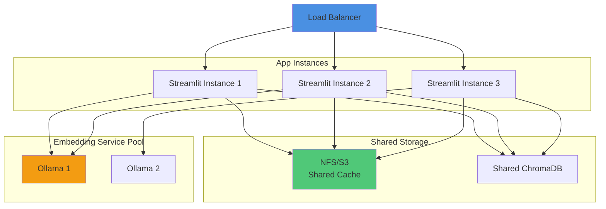

**Challenges:**
- ⚠️ Streamlit sessions are stateful (sticky sessions needed)
- ⚠️ Cache synchronization across instances
- ✅ ChromaDB supports concurrent reads
- ✅ Ollama can handle multiple connections

---

### 12.3 Optimization Opportunities

#### Current Optimizations

✅ **Implemented:**
- Batch embedding API calls
- Keyword extraction caching
- Squaring transformation (faster than exponential)
- Parallel resume processing (Streamlit limitations)

#### Future Optimizations

🔄 **Potential:**

1. **Async LLM Calls**
   ```python
   # Current: Sequential
   for resume in resumes:
       keywords = extract_keywords(jd, resume)  # 4-6s each

   # Future: Parallel
   tasks = [extract_keywords_async(jd, r) for r in resumes]
   keywords = await asyncio.gather(*tasks)  # All at once
   ```

2. **Embedding Precomputation**
   - Store common JD embeddings
   - Cache resume embeddings by hash
   - Reduce repeat computation

3. **Database Indexing**
   ```python
   # Add metadata index in ChromaDB
   collection.create_index(field="metadata.source")
   ```

4. **Lazy Loading**
   - Generate feedback only on demand
   - Don't compute project score if no projects

---

### 12.4 Resource Limits

```python
# Recommended Limits

MAX_CONCURRENT_RESUMES = 50
MAX_FILE_SIZE_MB = 10
MAX_CHUNK_COUNT = 500  # ~500K characters = 250 pages
MAX_KEYWORD_COUNT = 200

# Timeouts
OLLAMA_TIMEOUT = 60  # seconds
OPENAI_TIMEOUT = 30  # seconds
TOTAL_TIMEOUT = 300  # 5 minutes per resume batch
```

---

## 13. Testing Strategy

### 13.1 Test Pyramid

```
           ┌───────────┐
          /  Manual    \     5%  - Exploratory testing
         /   Testing    \         - UI/UX validation
        └────────────────┘
       ┌──────────────────┐
      /  Integration      \   15% - API integration tests
     /     Tests           \       - End-to-end workflows
    └──────────────────────┘
   ┌────────────────────────┐
  /     Unit Tests           \  80% - Function-level tests
 /                            \      - Algorithm validation
└──────────────────────────────┘
```

---

### 13.2 Unit Test Coverage

**File:** `test_resume_matcher.py` (498 lines)

**Test Suites:**

1. **Similarity Calculations** (Lines 1-50)
   ```python
   test_cosine_similarity()
   test_keyword_similarity()
   test_hybrid_similarity()
   ```

2. **Experience Extraction** (Lines 51-150)
   ```python
   test_extract_years_from_jd()
   test_extract_years_from_resume()
   test_experience_scoring()
   ```

3. **Role Matching** (Lines 151-200)
   ```python
   test_role_extraction()
   test_role_keyword_matching()
   ```

4. **Project Scoring** (Lines 201-250)
   ```python
   test_project_chunk_identification()
   test_project_similarity_calculation()
   ```

5. **Skill Scoring** (Lines 251-300)
   ```python
   test_skill_score_calculation()
   test_keyword_deduplication()
   ```

6. **Final Score** (Lines 301-350)
   ```python
   test_final_score_weights()
   test_final_score_bounds()
   ```

7. **Squaring Transformation** (Lines 351-400)
   ```python
   test_squaring_adjustment()
   test_discrimination_improvement()
   ```

8. **Integration Test Cases** (Lines 401-498)
   ```python
   test_case_1_perfect_match()
   test_case_2_partial_match()
   test_case_3_no_match_opposite_domain()
   test_case_4_low_experience()
   ```

**Run Tests:**
```bash
python test_resume_matcher.py
```

**Expected Output:**
```
test_cosine_similarity ........................... ✓ PASS
test_keyword_similarity .......................... ✓ PASS
test_experience_extraction ....................... ✓ PASS
test_experience_scoring .......................... ✓ PASS
test_role_extraction ............................. ✓ PASS
test_project_similarity .......................... ✓ PASS
test_skill_score_calculation ..................... ✓ PASS
test_final_score_weights ......................... ✓ PASS
test_squaring_adjustment ......................... ✓ PASS
test_case_1_perfect_match ........................ ✓ PASS (Score: 89.5%)
test_case_2_partial_match ........................ ✓ PASS (Score: 52.3%)
test_case_3_no_match ............................. ✓ PASS (Score: 22.1%)
test_case_4_low_experience ....................... ✓ PASS (Score: 58.7%)

========================================
All 13 tests passed ✓
========================================
```

---

### 13.3 Integration Testing

**File:** `TESTING_GUIDE.md`

**Manual Test Cases:**

| Test Case | Scenario | Expected Score | Validates |
|-----------|----------|----------------|-----------|
| TC1 | Perfect Match | 85-95% | All components working |
| TC2 | Partial Match | 45-60% | Balanced scoring |
| TC3 | Opposite Domain | 15-30% | Squaring fix |
| TC4 | Low Experience | 50-65% | Experience weighting |

**Execution Steps:**

1. Prepare test data (JD + 4 resumes)
2. Run Streamlit app
3. Upload files
4. Verify scores match expected ranges
5. Check keyword lists for no duplicates
6. Validate cache indicators
7. Generate feedback (qualitative check)

---

### 13.4 Health Check Testing

**File:** `quick_test.py` (233 lines)

**Checks:**

```python
def test_ollama_connection():
    # Verify Ollama service is running
    # Expected: HTTP 200

def test_embedding_generation():
    # Generate test embedding
    # Expected: 768-dim vector, non-zero

def test_openai_api():
    # Simple completion test
    # Expected: Valid response

def test_weight_calculation():
    # Verify weights sum to 1.0
    # Expected: 0.20+0.35+0.10+0.20+0.15 = 1.0

def test_cache_functionality():
    # Write and read cache
    # Expected: Identical data
```

**Run Health Check:**
```bash
python quick_test.py
```

---

### 13.5 Performance Testing

**Load Test Script:**

```python
import time
import statistics

def load_test(num_resumes=50):
    times = []

    for i in range(num_resumes):
        start = time.time()
        result = match_resume(jd, resume)
        elapsed = time.time() - start
        times.append(elapsed)

    print(f"Total time: {sum(times):.1f}s")
    print(f"Avg per resume: {statistics.mean(times):.1f}s")
    print(f"Median: {statistics.median(times):.1f}s")
    print(f"95th percentile: {statistics.quantiles(times, n=20)[18]:.1f}s")

# Expected results:
# Total: 300-600s (5-10 min)
# Avg: 6-12s
# Median: 8s
# P95: 15s
```

---

## 14. Monitoring & Logging

### 14.1 Logging Strategy

**Log Levels:**

```python
import logging

logging.basicConfig(
    level=logging.INFO,
    format='%(asctime)s [%(levelname)s] %(name)s: %(message)s',
    handlers=[
        logging.FileHandler('logs/app.log'),
        logging.StreamHandler()
    ]
)

logger = logging.getLogger('ResumeMatcher')
```

**What to Log:**

| Event | Level | Example |
|-------|-------|---------|
| Resume upload | INFO | `Uploaded 5 resumes` |
| Ollama call | DEBUG | `Embedding request: 23 chunks` |
| OpenAI call | INFO | `Keyword extraction: $0.002` |
| Cache hit | DEBUG | `Cache hit: abc123...` |
| Error | ERROR | `Ollama timeout after 60s` |
| Warning | WARNING | `File size exceeds 8MB` |

---

### 14.2 Metrics to Track

**Application Metrics:**

```python
# Processing time per resume
resume_processing_time = Histogram(
    'resume_processing_seconds',
    'Time to process one resume'
)

# Component score distribution
component_scores = Summary(
    'component_score',
    'Distribution of component scores',
    ['component_name']
)

# Cache hit rate
cache_hits = Counter('cache_hits_total')
cache_misses = Counter('cache_misses_total')

# API call counts
openai_calls = Counter('openai_api_calls_total', ['endpoint'])
ollama_calls = Counter('ollama_api_calls_total', ['operation'])
```

**Business Metrics:**

- Resumes processed per day
- Average match score
- Cache hit rate (target: >70%)
- Feedback generation rate
- Resume rewrite usage

---

### 14.3 Error Tracking

**Error Categories:**

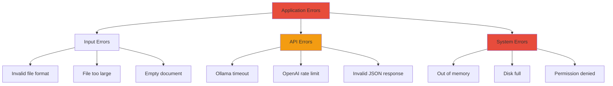

**Error Handling:**

```python
try:
    embeddings = ollama_client.get_embeddings(chunks)
except requests.Timeout:
    logger.error("Ollama timeout", exc_info=True)
    st.error("Embedding service timed out. Please try again.")
    return None
except requests.ConnectionError:
    logger.error("Ollama connection failed", exc_info=True)
    st.error("Cannot connect to Ollama. Ensure it's running.")
    return None
```

---

## 15. Error Handling

### 15.1 Error Handling Flow

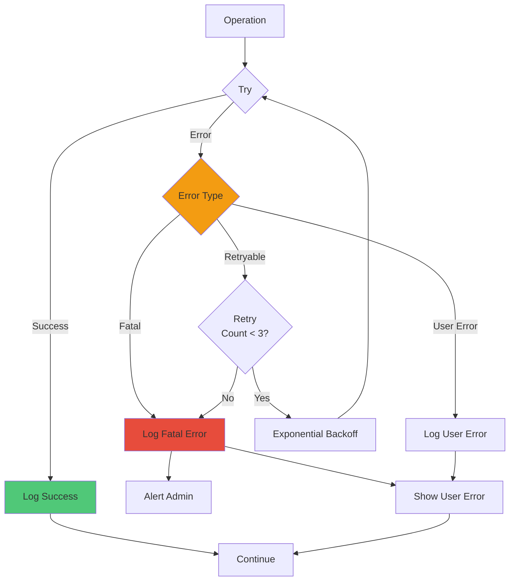

---

### 15.2 Error Recovery Strategies

| Error Type | Strategy | User Message |
|------------|----------|--------------|
| **Ollama timeout** | Retry 3× with backoff | "Embedding service slow, retrying..." |
| **OpenAI rate limit** | Wait and retry | "API rate limit hit, waiting 60s..." |
| **Invalid JSON** | Parse best-effort | "Partial keyword extraction succeeded" |
| **File too large** | Reject immediately | "File exceeds 10MB limit" |
| **Empty embedding** | Return zero vector | "Warning: Zero embedding detected" |
| **Cache read error** | Delete and regenerate | "Cache corrupted, regenerating..." |

---

### 15.3 Graceful Degradation

**Fallback Mechanisms:**

```python
# Fallback 1: Batch → Individual embeddings
def get_embeddings_with_fallback(texts):
    try:
        # Try batch
        return batch_embed(texts)
    except Exception:
        # Fallback to individual
        logger.warning("Batch embedding failed, using fallback")
        return [single_embed(t) for t in texts]

# Fallback 2: LLM → Rule-based keyword extraction
def extract_keywords_with_fallback(jd, resume):
    try:
        # Try LLM
        return llm_extract_keywords(jd, resume)
    except Exception:
        # Fallback to regex
        logger.warning("LLM extraction failed, using regex")
        return regex_extract_keywords(jd, resume)

# Fallback 3: Project score → 0% if no projects
def project_similarity_safe(jd_emb, chunks, chunk_embs):
    project_chunks = [i for i, c in enumerate(chunks)
                      if "project" in c.lower()]
    if not project_chunks:
        return 0.0  # Graceful degradation

    return calculate_project_score(jd_emb, project_chunks, chunk_embs)
```

---

## 16. Future Enhancements

### 16.1 Roadmap

#### Phase 1: Core Improvements (Q1 2025)

- [ ] **Multi-language Support:** Spanish, French, German JDs
- [ ] **PDF Support:** Extract text from PDF resumes
- [ ] **Async Processing:** Parallel LLM calls
- [ ] **Database Migration:** PostgreSQL for better scalability
- [ ] **User Authentication:** Multi-tenant support

---

#### Phase 2: Advanced Features (Q2 2025)

- [ ] **Skill Ontology:** Hierarchical skill matching (Python → Programming)
- [ ] **Industry Templates:** Pre-configured scoring for domains (Tech, Finance, Healthcare)
- [ ] **Candidate Ranking:** Relative scoring across all resumes
- [ ] **Bias Detection:** Flag potentially biased JD language
- [ ] **Interview Question Generator:** AI-generated questions per candidate

---

#### Phase 3: Enterprise Features (Q3 2025)

- [ ] **ATS Integration:** Connect to Workday, Greenhouse, Lever
- [ ] **Bulk Processing:** Handle 1000+ resumes
- [ ] **Custom Workflows:** Configurable scoring weights
- [ ] **Audit Logs:** Compliance tracking
- [ ] **GDPR Compliance:** Data retention policies

---

### 16.2 Technical Debt

**Known Issues:**

1. **Streamlit Limitations:**
   - No native async support
   - Session state management complex
   - **Resolution:** Migrate to FastAPI + React

2. **Cache Invalidation:**
   - No TTL (Time To Live)
   - Manual cleanup required
   - **Resolution:** Implement LRU cache with expiration

3. **Embedding Storage:**
   - ChromaDB not optimized for production
   - No replication/backup
   - **Resolution:** Migrate to Pinecone/Weaviate

4. **LLM Costs:**
   - OpenAI API expensive at scale
   - **Resolution:** Fine-tune local models (Llama, Mistral)

---

### 16.3 Research Opportunities

1. **Semantic Refinement:**
   - Investigate domain-specific embeddings
   - Compare models: BGE, E5, Instructor

2. **Scoring Algorithm:**
   - Machine learning-based weight optimization
   - Learn from historical hiring decisions

3. **Keyword Extraction:**
   - NER (Named Entity Recognition) models
   - Fine-tuned on job posting corpus

4. **Explainability:**
   - Attention visualization
   - SHAP values for score attribution

---

## 17. Appendices

### Appendix A: File Structure

```
ResumeMatcher/
├── Dev/
│   ├── ResumeMatcher_Levelwise.py      # Main application (883 lines)
│   ├── test_resume_matcher.py          # Unit tests (498 lines)
│   ├── quick_test.py                   # Health checks (233 lines)
│   ├── requirements.txt                # Python dependencies
│   ├── SYSTEM_DESIGN_DOCUMENT.md       # This document
│   ├── SEMANTIC_SCORING_FIX.md         # Squaring fix documentation
│   ├── TESTING_GUIDE.md                # Testing guide
│   ├── README_TESTING.md               # Quick reference
│   ├── .chromadb/                      # Vector database
│   │   └── chroma.sqlite3
│   └── .keyword_cache/                 # LLM response cache
│       └── *.pkl
├── Docs/
│   └── What_Makes_a_Good_Match.pdf
└── .git/
```

---

### Appendix B: Dependencies

```txt
# requirements.txt

streamlit==1.28.0               # Web UI framework
pandas==2.1.0                   # Data manipulation
numpy==1.25.0                   # Numerical computing
python-docx==0.8.11             # Word document processing
openai==1.3.0                   # OpenAI API client
chromadb==0.4.15                # Vector database
requests==2.31.0                # HTTP client

# Optional
matplotlib==3.8.0               # Visualization
pytest==7.4.0                   # Testing framework
```

---

### Appendix C: API Rate Limits

**OpenAI API (gpt-4o-mini):**

| Tier | RPM | TPM | RPD |
|------|-----|-----|-----|
| Free | 3 | 40K | 200 |
| Tier 1 | 500 | 2M | - |
| Tier 2 | 5000 | 10M | - |

**Ollama (Local):**
- No rate limits
- Limited by hardware (CPU/GPU)
- Concurrent requests: ~5-10

---

### Appendix D: Cost Estimation

**Per Resume Processing:**

| Component | Cost | Notes |
|-----------|------|-------|
| Ollama embedding | $0 | Local, free |
| Keyword extraction | $0.001 | ~500 tokens |
| Role extraction | $0.0003 | ~150 tokens |
| Feedback generation | $0.002 | ~1000 tokens |
| Resume rewriting | $0.005 | ~2000 tokens |
| **Total** | **$0.008** | **~0.8¢ per resume** |

**Batch (100 resumes):**
- Total cost: $0.80
- With cache (70% hit rate): $0.24

---

### Appendix E: Glossary

| Term | Definition |
|------|------------|
| **Cosine Similarity** | Measure of angle between two vectors, range 0-1 |
| **Embedding** | Dense numerical representation of text (768-dim vector) |
| **JD** | Job Description |
| **LLM** | Large Language Model |
| **NER** | Named Entity Recognition |
| **Squaring Adjustment** | Transformation: x → x × |x| to amplify differences |
| **Semantic Matching** | Understanding meaning, not just keywords |
| **Vector Database** | Database optimized for similarity search |
| **Chunk** | Text segment (2000 chars in this system) |

---

### Appendix F: References

1. **Embedding Models:**
   - nomic-embed-text: https://github.com/nomic-ai/nomic-embed
   - MTEB Leaderboard: https://huggingface.co/spaces/mteb/leaderboard

2. **LLM APIs:**
   - OpenAI Documentation: https://platform.openai.com/docs
   - Ollama API: https://github.com/ollama/ollama/blob/main/docs/api.md

3. **Vector Databases:**
   - ChromaDB Docs: https://docs.trychroma.com/
   - Pinecone: https://www.pinecone.io/
   - Weaviate: https://weaviate.io/

4. **Frameworks:**
   - Streamlit: https://docs.streamlit.io/
   - LangChain: https://python.langchain.com/

---

### Appendix G: Contact & Support

**Development Team:**
- Project Lead: [Name]
- Email: [Email]
- Repository: [GitHub URL]
- Documentation: [Confluence/Wiki URL]

**Support Channels:**
- Slack: #resume-matcher
- Email: support@company.com
- Issue Tracker: [GitHub Issues URL]

---

## Document Approval

| Role | Name | Signature | Date |
|------|------|-----------|------|
| **Author** | AI Development Team | ___________ | 2025-11-11 |
| **Reviewer** | Technical Lead | ___________ | |
| **Approver** | Engineering Manager | ___________ | |

---

**END OF DOCUMENT**

---

*This design document is a living document and should be updated as the system evolves.*
